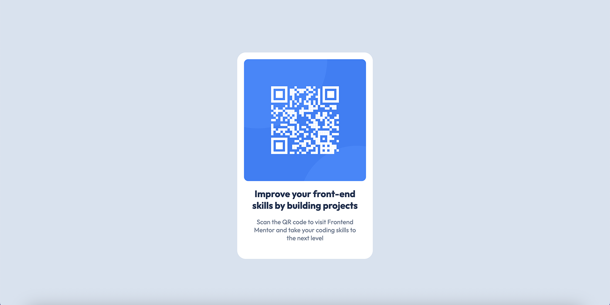

# Frontend Mentor - QR Code Component Solution

This is my solution to the [QR code component challenge](https://www.frontendmentor.io/challenges/qr-code-component-iux_sIO_H) on Frontend Mentor.

Frontend Mentor challenges help improve coding skills by building real-world UI components from designs.

---

## 📸 Screenshot


---

## Built with

- Semantic HTML5
- CSS custom properties
- Flexbox
- CSS Grid
- Mobile-first workflow

## What I learned

This project helped me improve my understanding of:

- Centering elements using Flexbox and Grid
- The CSS box model (`box-sizing: border-box`)
- Structuring simple UI components
- Translating design files into clean HTML/CSS

Example of centering the card:

```css
.card-container {
  display: grid;
  place-items: center;
  height: 100vh;
}
```

## Continued development

Going forward, I want to focus on:

- Improving accessibility (e.g. semantic HTML and better text readability)
- Writing cleaner, reusable CSS using variables


---

## AI Collaboration

I used AI tools (ChatGPT) during this project for:

- Debugging CSS layout issues
- Understanding Flexbox vs Grid differences

---

## Author

- Frontend Mentor - [@mxria-a](https://www.frontendmentor.io/profile/mxria-a)
- GitHub - [https://github.com/mxria-a]